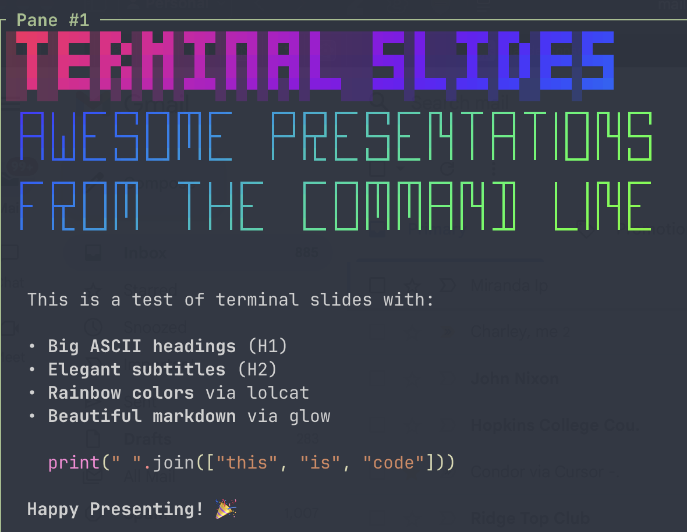

<h1 align="center">
Terminal Slides
</h1>

<p align="center">
  <strong>Awesome presentations from the command line</strong>
</p>

<p align="center">
  
</p>

## ✨ Features

- 🎭 **Big ASCII headings** with rainbow gradients via `lolcat`
- 📝 **Beautiful markdown rendering** via `glow`
- 🎨 **Customizable fonts** for H1 and H2 headings
- 📏 **Responsive design** that adapts to terminal width
- ⌨️ **Simple navigation** with arrow keys or spacebar
- 🚀 **Zero dependencies** except common terminal tools

## 🚀 Quick Start

```bash
./present.sh example.md
```

Navigate with:
- `Space` or `→` - Next slide
- `←` - Previous slide
- `q` - Quit

## 🎨 Customization

Change fonts with environment variables:

```bash
# Use different H1 font
TOILET_FONT=bigmono12 ./present.sh slides.md

# Use different H2 font
TOILET_FONT_H2=future ./present.sh slides.md

# Limit width for large displays
./present.sh slides.md 120
```

## 📦 Dependencies

- `toilet` - ASCII art text rendering
- `lolcat` - Rainbow color gradients
- `glow` - Markdown rendering

Install on macOS:
```bash
brew install toilet lolcat glow
```

## 📝 Creating Slides

Write markdown with `#` for slide breaks:

```markdown
# First Slide
## A subtitle

Some content here

# Second Slide
More content...
```

Each `# H1` heading starts a new slide.

## 📄 License

The [Unlicense](https://unlicense.org)
